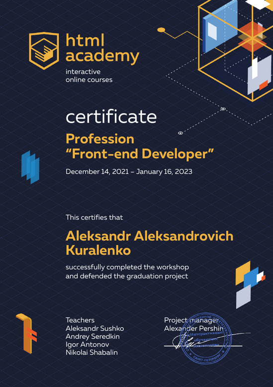

# **Aleksandr Kuralenko**
## *Junior frontend developer*

## **Contacts:**
> Telegram: *[SOA88co](https://t.me/soa88com)*\
> Email: *[alexsandermoon@gmail.com](alexsandermoon@gmail.com)*

## **About myself:**
> I lead a healthy lifestyle, I like to visit new countries and learn something new. Now I'm mastering the technologies of the frontend world,\ 
> I like to do this, when interesting and useful "things" can appear from the strings of characters in the editor that may be useful to others - it's 
> cool... at the same time, you can always find a different approach to get the desired result\)\
> We teach quickly, I try to master new technologies.\
> I have experience working with automotive, industrial, and computer equipment.\
> In the course of his training and practice , he had to perform:
> * Creation of interactive elements such as tabs, accordions and sliders, forms with validation and modals.
> * Work with the terms of reference, compliance with the criteria and edits from the bugs of testers or improvements after the code review.
> I am looking for and studying additional information on these topics.

## **Software skills:**
> * HTML, CSS, markdown, preprocessor languages: SASS / Less / PUG;
> * methodology BEM;
> * adaptive, flexible layout and valid layout;
> * Figma graphics redactor;
> * JavaScript(ES5,ES6) *junior level*;
> * librarys: SwiperJS, Liaflet;
> * Git, GitHub;
> * editors: VS Code, Sublime Text;
> * task manager Gulp;
> * module builder WebPack *junior level*;

## **Code example:**
Simple multiplication from CODEWARS: *This kata is about multiplying a given number by eight if it is an even number and by nine otherwise*.
```
function simpleMultiplication(number) {
    if(number % 2 === 0) {
      return number * 8;
    }
    return number * 9;
}
```

## **Courses:**
> * Interactive online courses on the [HTMLAcademy](https://htmlacademy.ru/intensive/javascript): *Profession Front-end Developer*;\
> ;